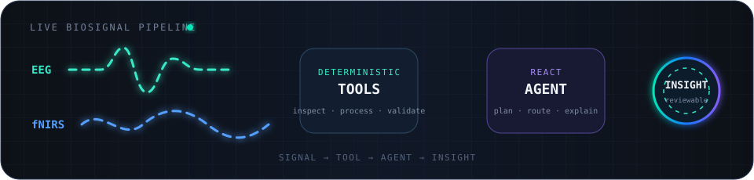
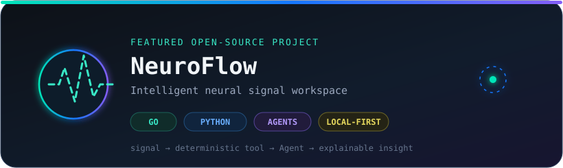

<div align="center">


<a href="https://git.io/typing-svg">
  
</a>

<p>
  <a href="https://xczchaos.github.io/"></a>
  <a href="https://github.com/XCZchaos/NeuroFlow"></a>
  <a href="mailto:asherxiong552@gmail.com"></a>
  
</p>



</div>

## `> whoami`

```yaml
alias: eborn
focus: wearable biosignals · multimodal computing · AI Agents
building: NeuroFlow
principles: local-first · deterministic tools · explainable results
status: open to BCI, research, engineering, and open-source collaboration
```

I build systems that connect **physiological signals, dependable algorithms, and usable software**—from data inspection and preprocessing to Agent orchestration, real-time interfaces, and reproducible analysis workflows.

## `> current_project --featured`

<div align="center">
  <a href="https://github.com/XCZchaos/NeuroFlow">
    
  </a>
</div>

### ⚡ NeuroFlow

An intelligent workspace for neurophysiological signal research, connecting **local dataset inspection → Agent planning → deterministic tools → quality review → reproducible reports**.

| Layer | Current implementation |
|---|---|
| 🖥️ Workspace | Electron desktop application and local-first data flow |
| 🧠 Neurodata | Python + MNE dataset inspection for EEG, MEG, and fNIRS |
| 🤖 Agent | Go, Gin, CloudWeGo Eino, ReAct, and structured tool calling |
| 📚 Knowledge | Ollama embeddings, Qdrant, and domain RAG |
| 🌊 Interaction | Multi-turn dataset context and SSE streaming responses |
| 🚧 Next | EEG/EMG tools, multimodal Agents, benchmarks, and reports |

<div align="center">
  <a href="https://github.com/XCZchaos/NeuroFlow"></a>
  <a href="https://github.com/XCZchaos/NeuroFlow/issues"></a>
</div>

## `> stack --visual`

<div align="center">

#### Core Languages & AI


#### Engineering


#### Signal & Agent Toolkit


</div>

## `> github --live`

<div align="center">
  
</div>

<div align="center">
  <h3>Contribution stream</h3>
  
</div>

## `> collaborate --open`

NeuroFlow welcomes contributors interested in:

- deterministic EEG, EMG, and fNIRS processing tools
- Agent routing, planning, tool schemas, and result validation
- public biosignal datasets and reproducible benchmarks
- Electron desktop UX and scientific visualization
- documentation, examples, automated checks, and engineering integration

<div align="center">
  <a href="https://github.com/XCZchaos/NeuroFlow/issues"></a>
  <a href="mailto:asherxiong552@gmail.com?subject=NeuroFlow%20Open%20Source%20Collaboration"></a>
</div>

<div align="center">

<br />

`Signal → Tool → Agent → Insight`


</div>
